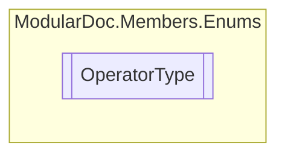

# OperatorType `enum`

## Description
Method operator types

## Diagram

## Details
### Summary
Method operator types

### Fields
#### None
##### Summary
Operator type undefined

#### Normal
##### Summary
No operator

#### Implicit
##### Summary
Implicit operator

#### Explicit
##### Summary
Explicit operator

*Generated with* [*ModularDoc*](https://github.com/hailstorm75/ModularDoc)
