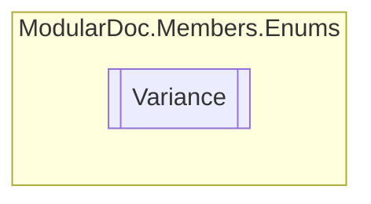

# Variance `enum`

## Description
Generic argument variance types

## Diagram

## Details
### Summary
Generic argument variance types

### Fields
#### NonVariant
##### Summary
No variance

#### Covariant
##### Summary
Covariance

#### Contravariant
##### Summary
Contra variance

*Generated with* [*ModularDoc*](https://github.com/hailstorm75/ModularDoc)
