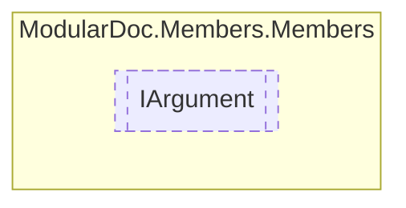

# IArgument `interface`

## Description
Interface for [IMethod](./IMethod.md) arguments

## Diagram


## Members
### Properties
#### Public  properties
| Type | Name | Methods |
| --- | --- | --- |
| [`ArgumentType`](../enums/ArgumentType.md) | [`Keyword`](#keyword)<br>Argument keyword | `get` |
| `string` | [`Name`](#name)<br>Argument name | `get` |
| [`IResType`](../resolvedtypes/IResType.md) | [`Type`](#type)<br>Argument type | `get` |

## Details
### Summary
Interface for [IMethod](./IMethod.md) arguments

### Properties
#### Name
```csharp
public string Name { get; }
```
##### Summary
Argument name

#### Keyword
```csharp
public ArgumentType Keyword { get; }
```
##### Summary
Argument keyword

#### Type
```csharp
public IResType Type { get; }
```
##### Summary
Argument type

*Generated with* [*ModularDoc*](https://github.com/hailstorm75/ModularDoc)
