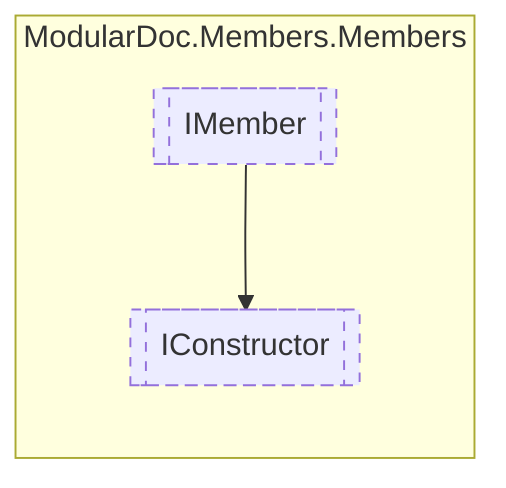

# IConstructor `interface`

## Description
Interface for type constructors

## Diagram


## Members
### Properties
#### Public  properties
| Type | Name | Methods |
| --- | --- | --- |
| `IReadOnlyCollection`&lt;[`IArgument`](./IArgument.md)&gt; | [`Arguments`](#arguments)<br>Method arguments | `get` |

## Details
### Summary
Interface for type constructors

### Inheritance
 - [
`IMember`
](./IMember.md)

### Properties
#### Arguments
```csharp
public IReadOnlyCollection<IArgument> Arguments { get; }
```
##### Summary
Method arguments

*Generated with* [*ModularDoc*](https://github.com/hailstorm75/ModularDoc)
