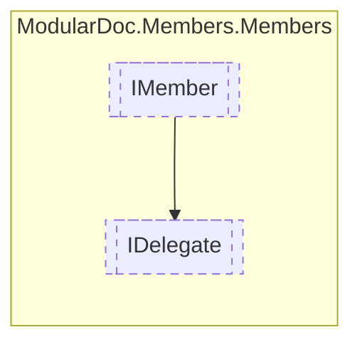

# IDelegate `interface`

## Description
Interface for delegate types

## Diagram


## Members
### Properties
#### Public  properties
| Type | Name | Methods |
| --- | --- | --- |
| `IReadOnlyCollection`&lt;[`IArgument`](./IArgument.md)&gt; | [`Arguments`](#arguments)<br>Delegate arguments | `get` |
| `IReadOnlyDictionary`&lt;`string`, `IReadOnlyCollection`&lt;[`IResType`](../resolvedtypes/IResType.md)&gt;&gt; | [`Generics`](#generics)<br>Method generic arguments | `get` |
| [`IResType`](../resolvedtypes/IResType.md) | [`Returns`](#returns)<br>Method return type | `get` |

## Details
### Summary
Interface for delegate types

### Inheritance
 - [
`IMember`
](./IMember.md)

### Properties
#### Arguments
```csharp
public IReadOnlyCollection<IArgument> Arguments { get; }
```
##### Summary
Delegate arguments

#### Generics
```csharp
public IReadOnlyDictionary<string, IReadOnlyCollection<IResType>> Generics { get; }
```
##### Summary
Method generic arguments

#### Returns
```csharp
public IResType Returns { get; }
```
##### Summary
Method return type

*Generated with* [*ModularDoc*](https://github.com/hailstorm75/ModularDoc)
