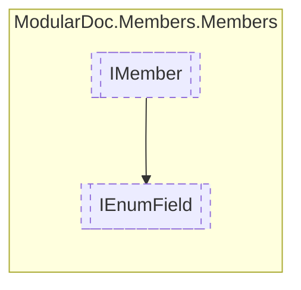

# IEnumField `interface`

## Description
Interface for enum field entries

## Diagram

## Details
### Summary
Interface for enum field entries

### Inheritance
 - [
`IMember`
](./IMember.md)

*Generated with* [*ModularDoc*](https://github.com/hailstorm75/ModularDoc)
