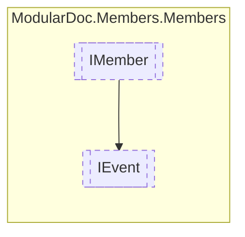

# IEvent `interface`

## Description
Interface for events

## Diagram


## Members
### Properties
#### Public  properties
| Type | Name | Methods |
| --- | --- | --- |
| [`MemberInheritance`](../enums/MemberInheritance.md) | [`Inheritance`](#inheritance)<br>Event inheritance type | `get` |
| [`IResType`](../resolvedtypes/IResType.md) | [`Type`](#type)<br>Event type | `get` |

## Details
### Summary
Interface for events

### Inheritance
 - [
`IMember`
](./IMember.md)

### Properties
#### Inheritance
```csharp
public MemberInheritance Inheritance { get; }
```
##### Summary
Event inheritance type

#### Type
```csharp
public IResType Type { get; }
```
##### Summary
Event type

*Generated with* [*ModularDoc*](https://github.com/hailstorm75/ModularDoc)
