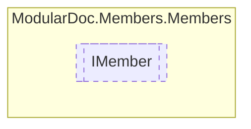

# IMember `interface`

## Description
Interface for type members

## Diagram


## Members
### Properties
#### Public  properties
| Type | Name | Methods |
| --- | --- | --- |
| [`AccessorType`](../enums/AccessorType.md) | [`Accessor`](#accessor)<br>Member accessor | `get` |
| `bool` | [`IsStatic`](#isstatic)<br>Is method static | `get` |
| `Nullable`&lt;(`int` line, `string` source)&gt; | [`LineSource`](#linesource)<br>Line number and source file of the given member | `get` |
| `string` | [`Name`](#name)<br>Member name | `get` |
| `string` | [`RawName`](#rawname)<br>Raw member name | `get` |

## Details
### Summary
Interface for type members

### Properties
#### IsStatic
```csharp
public bool IsStatic { get; }
```
##### Summary
Is method static

#### Name
```csharp
public string Name { get; }
```
##### Summary
Member name

#### RawName
```csharp
public string RawName { get; }
```
##### Summary
Raw member name

#### Accessor
```csharp
public AccessorType Accessor { get; }
```
##### Summary
Member accessor

#### LineSource
```csharp
public Nullable<(int line, string source)> LineSource { get; }
```
##### Summary
Line number and source file of the given member

*Generated with* [*ModularDoc*](https://github.com/hailstorm75/ModularDoc)
