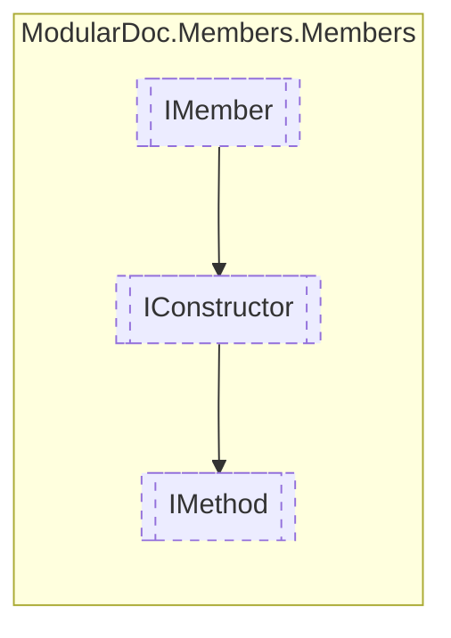

# IMethod `interface`

## Description
Interface for methods

## Diagram


## Members
### Properties
#### Public  properties
| Type | Name | Methods |
| --- | --- | --- |
| `IReadOnlyDictionary`&lt;`string`, `IReadOnlyCollection`&lt;[`IResType`](../resolvedtypes/IResType.md)&gt;&gt; | [`Generics`](#generics)<br>Method generic arguments | `get` |
| [`MemberInheritance`](../enums/MemberInheritance.md) | [`Inheritance`](#inheritance)<br>Method visibility | `get` |
| `bool` | [`IsAsync`](#isasync)<br>Determines whether the method is asynchronous | `get` |
| [`OperatorType`](../enums/OperatorType.md) | [`Operator`](#operator)<br>Operator type | `get` |
| [`IResType`](../resolvedtypes/IResType.md) | [`Returns`](#returns)<br>Method return type | `get` |

## Details
### Summary
Interface for methods

### Inheritance
 - [
`IConstructor`
](./IConstructor.md)
 - [
`IMember`
](./IMember.md)

### Properties
#### Inheritance
```csharp
public MemberInheritance Inheritance { get; }
```
##### Summary
Method visibility

#### Generics
```csharp
public IReadOnlyDictionary<string, IReadOnlyCollection<IResType>> Generics { get; }
```
##### Summary
Method generic arguments

#### IsAsync
```csharp
public bool IsAsync { get; }
```
##### Summary
Determines whether the method is asynchronous

#### Operator
```csharp
public OperatorType Operator { get; }
```
##### Summary
Operator type

#### Returns
```csharp
public IResType Returns { get; }
```
##### Summary
Method return type

*Generated with* [*ModularDoc*](https://github.com/hailstorm75/ModularDoc)
