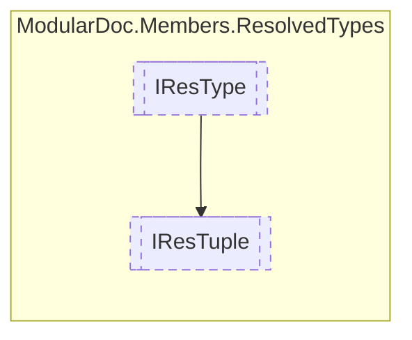

# IResTuple `interface`

## Description
Interface for resolved tuples

## Diagram


## Members
### Properties
#### Public  properties
| Type | Name | Methods |
| --- | --- | --- |
| `IReadOnlyCollection`&lt;(`string` name, [`IResType`](./IResType.md) type)&gt; | [`Fields`](#fields)<br>Tuple fields | `get` |
| `bool` | [`IsValueTuple`](#isvaluetuple)<br>Determines whether the tuple is a value tuple | `get` |

## Details
### Summary
Interface for resolved tuples

### Inheritance
 - [
`IResType`
](./IResType.md)

### Properties
#### Fields
```csharp
public IReadOnlyCollection<(string name, IResType type)> Fields { get; }
```
##### Summary
Tuple fields

#### IsValueTuple
```csharp
public bool IsValueTuple { get; }
```
##### Summary
Determines whether the tuple is a value tuple

*Generated with* [*ModularDoc*](https://github.com/hailstorm75/ModularDoc)
