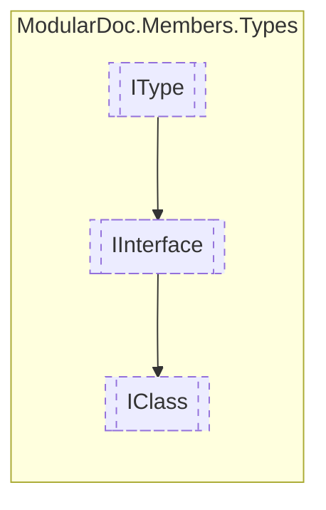

# IClass `interface`

## Description
Interface for classes

## Diagram


## Members
### Properties
#### Public  properties
| Type | Name | Methods |
| --- | --- | --- |
| [`IResType`](../resolvedtypes/IResType.md) | [`BaseClass`](#baseclass)<br>Inherited base class | `get` |
| `IReadOnlyCollection`&lt;[`IConstructor`](../members/IConstructor.md)&gt; | [`Constructors`](#constructors)<br>Class constructors | `get` |
| `bool` | [`IsAbstract`](#isabstract)<br>Determines whether this class is abstract | `get` |
| `bool` | [`IsSealed`](#issealed)<br>Determines whether this class is sealed | `get` |
| `bool` | [`IsStatic`](#isstatic)<br>Determines whether this class is static | `get` |

## Details
### Summary
Interface for classes

### Inheritance
 - [
`IInterface`
](./IInterface.md)
 - [
`IType`
](./IType.md)

### Properties
#### IsStatic
```csharp
public bool IsStatic { get; }
```
##### Summary
Determines whether this class is static

#### IsSealed
```csharp
public bool IsSealed { get; }
```
##### Summary
Determines whether this class is sealed

#### IsAbstract
```csharp
public bool IsAbstract { get; }
```
##### Summary
Determines whether this class is abstract

#### BaseClass
```csharp
public IResType BaseClass { get; }
```
##### Summary
Inherited base class

#### Constructors
```csharp
public IReadOnlyCollection<IConstructor> Constructors { get; }
```
##### Summary
Class constructors

*Generated with* [*ModularDoc*](https://github.com/hailstorm75/ModularDoc)
