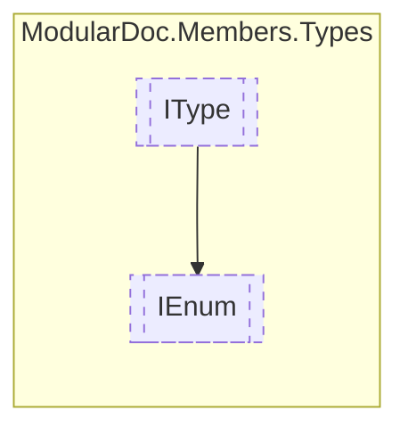

# IEnum `interface`

## Description
Interface for enums

## Diagram


## Members
### Properties
#### Public  properties
| Type | Name | Methods |
| --- | --- | --- |
| `IReadOnlyCollection`&lt;[`IEnumField`](../members/IEnumField.md)&gt; | [`Fields`](#fields)<br>Enum fields | `get` |

## Details
### Summary
Interface for enums

### Inheritance
 - [
`IType`
](./IType.md)

### Properties
#### Fields
```csharp
public IReadOnlyCollection<IEnumField> Fields { get; }
```
##### Summary
Enum fields

*Generated with* [*ModularDoc*](https://github.com/hailstorm75/ModularDoc)
