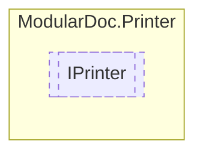

# IPrinter `interface`

## Description
Interface for documentation printers

## Diagram


## Members
### Methods
#### Public  methods
| Returns | Name |
| --- | --- |
| `Task` | [`Print`](#print)(`IEnumerable`&lt;[`IType`](../members/types/IType.md)&gt; types, `string` path) |

## Details
### Summary
Interface for documentation printers

### Methods
#### Print
```csharp
public Task Print(IEnumerable<IType> types, string path)
```
##### Arguments
| Type | Name | Description |
| --- | --- | --- |
| `IEnumerable`&lt;[`IType`](../members/types/IType.md)&gt; | types |   |
| `string` | path |   |

*Generated with* [*ModularDoc*](https://github.com/hailstorm75/ModularDoc)
